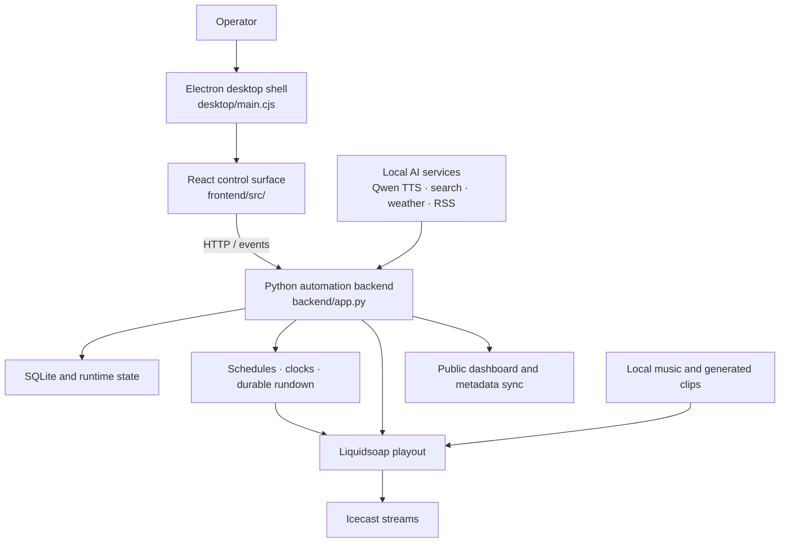

## Current broadcast PC runtime — 7 October 2026

The current EN/FR service implementation uses local Laya 0.3.22 for genuine next-song decisions, a four-song rolling music queue, Qwen3 0.6B for host text and Kokoro 82M for speech. English links are scheduled after every song. The full eligible catalog is encoder-ranked, with 64 finalists receiving actual typed-head probabilities. Production source-clock reporting and durable evidence delivery are independent of rendering.

See [broadcast PC runtime](docs/broadcast-pc-runtime.md) for setup and implementation details, [the service integration](https://github.com/radiotedu/services-companion) for Windows deployment, and [the current web/API repair handoff](docs/radiotedu-web-api-fix-20261007.md) for the remaining HTTP 422 selection validator and origin listener continuity issues. Successful preparation is not proof of uninterrupted listener reception. This current runtime section supersedes older TTS/selection examples below.

<p align="center">
  
</p>

<p align="center">
  
</p>

<h1 align="center">RTAI Radio</h1>

<p align="center">
  A local-first bilingual radio platform for autonomous programming, resilient
  playout, listener publishing, and broadcast operations.
</p>

<p align="center">
  <a href="https://radiotedu.com/ai">Listen</a> ·
  <a href="docs/BROADCAST_COMPUTER_RUNBOOK.md">Broadcast runbook</a> ·
  <a href="docs/WEBSITE_SERVER_RUNBOOK.md">Website runbook</a> ·
  <a href="docs/NEXT_TODOS.md">Roadmap</a>
</p>

RTAI Radio is the core RadioTEDU broadcast platform. English (`radiotedu-en`)
and French (`radiotedu-fr`) run as isolated station processes; each owns its own
autonomous orchestrator, database, rundown, queues, fallback playlist,
Liquidsoap process, health, metadata, and logs. One top-level supervisor and one
process-level `PublicSyncService` coordinate lifecycle and public status without
controlling music selection.

The listener website is `https://radiotedu.com/ai`. The current public audio URLs are English `https://stream.radiotedu.com/ai` and French `https://stream.radiotedu.com/event`; the obsolete `/en` and `/fr` Icecast mounts are not used.

There is no demo mode and no invented listening data. Add your own local music before starting playback. If no playable music exists, the backend and dashboard still run, the station stays idle, and the dashboard asks you to add music and rescan.

For the next implementation backlog, see
[`docs/NEXT_TODOS.md`](docs/NEXT_TODOS.md).

## At a glance

| Area | What this repository provides |
| --- | --- |
| Stations | Independent English and French runtimes with durable rundowns and fallbacks |
| Intelligence | Local Ollama planning plus optional local Qwen TTS announcements |
| Playout | Liquidsoap and Icecast integration with supervised lifecycle management |
| Listener experience | Public React website, live metadata, artwork, and stream status |
| Operations | Windows service packaging, health dashboard, handoff guides, and smoke tests |

## Repository guide

- **Start here:** [Quickstart](#quickstart), [music library](#current-music-library),
  and [local AI](#local-ai)
- **Programming:** [live playout](#probabilistic-live-playout),
  [orchestrator](#autonomous-orchestrator), [programs](#programs), and
  [playback](#playback)
- **Services:** [TTS](#tts), [search](#search), [weather](#weather), and
  [curated RSS news](#curated-rss-news)
- **Broadcast stack:** [Liquidsoap and Icecast](#liquidsoap-and-icecast),
  [cover art](#cover-art), and [observability](#observability)
- **Deployment:** [builder handoff](#builder-handoff) and the
  [broadcast](docs/BROADCAST_COMPUTER_RUNBOOK.md) and
  [website](docs/WEBSITE_SERVER_RUNBOOK.md) runbooks

## Quickstart

```bash
git clone https://github.com/radiotedu/rtai-radio.git
cd rtai-radio
python -m venv .venv
source .venv/bin/activate
pip install -r requirements.txt
npm ci
mkdir -p data/music
python scripts/scan_music.py
python -m backend.app
```

In another terminal:

```bash
npm run dev
```

Open `http://localhost:5173`.

## Builder handoff

This repository contains the listener website, broadcast runtime, metadata agent, Windows service packaging, health dashboard, deployment verification and tests. The two—and only two—target-machine Codex instructions are:

- `handoff/broadcast-server/prompt.md`
- `handoff/web-server/prompt.md`

Each target Codex performs its own discovery, protected configuration, installation and verification. Secrets, local music, Qwen model weights, generated Qwen audio, live runtime state, logs and caches are intentionally excluded from Git.

## Current Music Library

The portable default is:

```env
MUSIC_DIR=data/music
```

On the broadcasting computer, configure each station profile to its operator-supplied, rights-cleared local media root. The library may include pop, jazz, classical, and other approved music; the runtime does not contact anyone, purchase music, or download replacements. The scanner walks each directory recursively, stores metadata in the station-local SQLite database, deduplicates by file path, and keeps selection queries limited so large libraries stay manageable on an 8 GB CPU-only machine.

## Local AI

The portable default LLM is Ollama with `qwen2.5:0.5b-instruct`:

```bash
ollama pull qwen2.5:0.5b-instruct
```

For this workstation, the live `.env` uses the stronger local 4B model you selected:

```env
OLLAMA_MODEL=qwen3.5:4b
```

Check the local runtime without installing or pulling anything:

```bash
python scripts/check_ollama.py
python scripts/check_ollama.py --json
```

The checker reports whether the Ollama CLI exists, whether the server is reachable, and whether the configured model is installed. It returns suggested commands such as:

```bash
winget install Ollama.Ollama
ollama serve
ollama pull qwen3.5:4b
```

It never installs, starts, or downloads anything unless you explicitly ask it to:

```bash
python scripts/check_ollama.py --pull
```

To explicitly bootstrap the local Windows runtime in one command:

```bash
python scripts/check_ollama.py --install --start --pull
```

The DJ prompt is intentionally small and JSON-only. If Ollama is unavailable or returns invalid JSON, RadioTEDU picks from real candidate tracks deterministically and writes a short deterministic DJ line.

The dashboard separates configured model from runtime health. `health.llm` shows the requested model name, while `health.llm_runtime` checks the Ollama `/api/tags` endpoint and reports whether the server is reachable and whether the configured model is installed. The backend also exposes `GET /api/setup/ollama` for the same setup guidance used by the checker script.

## Probabilistic live playout

The temporary EN/FR live runtime uses fresh cryptographic entropy for every station
session and selects music by randomized, no-replacement cycles. A restart therefore
does not replay a fixed seed sequence.

Track announcements are prepared ahead of airtime because CPU-only Qwen synthesis is
slower than real time. Each eligible song keeps two independently rendered,
song-specific Qwen variants. Playout selects among the variants with explicit
weights and excludes the variant used on the previous play of that track when an
alternative is ready. The background worker prioritizes the live `now`/`next`
horizon and adds new variants atomically; an existing valid variant remains
available throughout generation, so probability growth cannot create dead air.

The live status exposes the selection modes, a non-secret session-seed fingerprint,
ready variant counts, multi-variant track counts and queue depth. Qwen model weights,
generated speech, runtime manifests and local music remain outside Git.

## Autonomous Orchestrator

RadioTEDU can keep the station running continuously while the backend process is alive:

```env
AUTONOMY_ENABLED=true
AUTONOMY_TICK_SECONDS=30
STRATEGY_INTERVAL_MINUTES=240
```

The orchestrator is intentionally local and conservative. English and French each run one station-local orchestrator with separate databases, rundowns, queues, fallback playlists, Liquidsoap state, health, metadata, and logs. Each tick maintains duration coverage, performs at most one optional speech render, and claims one ready rundown row only when playout is idle. Search, LLM, Qwen, FFmpeg, or website failure cannot block the next ready music track. A top-level supervisor recovers one station process without restarting the other, while one process-level `PublicSyncService` publishes status for both.

Listener feedback submitted through the dashboard is sanitized for the non-financial station scope, stored as local autonomy memory, and answered with a queued local TTS reply. This works even before music is indexed; it does not invent listener counts or popularity.

Use the dashboard Start and Stop buttons to start or stop the in-process runner. Stop shuts down the runner and leaves the backend available.

For a watchdog that restarts the backend if it exits, run:

```bash
python scripts/run_station_forever.py --root F:/RTAI/RadioTEDU --frontend
```

On Windows, you can register that watchdog at login:

```powershell
powershell -ExecutionPolicy Bypass -File scripts/install_windows_task.ps1 -ProjectRoot F:\RTAI\RadioTEDU -WithFrontend
```

### Durable rundown and announcement rendering

Each station plans and renders ahead by actual audio duration:

```env
RUNDOWN_PLANNED_SECONDS=14400
RUNDOWN_RENDERED_SECONDS=3600
RUNDOWN_REFILL_SECONDS=7200
FALLBACK_COVERAGE_SECONDS=21600
MIN_READY_ANNOUNCEMENTS=5
MAX_READY_ANNOUNCEMENTS=8
```

The production readiness gate is at least four hours planned, 60 minutes rendered, and six hours of validated local fallback music. The planner refills strictly below two hours and keeps a one-track cushion when a duration lands exactly on a threshold. The announcement count remains a compatibility/diagnostic metric; it does not replace duration readiness.

Prepared speech remains track-bound. Pop gets short unsourced radio fillers and greetings such as “have a good day”; do not research pop songs. Research is limited to jazz and classical, requires an exact local title-and-artist match plus HTTP(S) provenance, rejects lyrics/transcripts, and falls back to curated catalog metadata when no strict source matches.

Rundown playout prefers a prepared talk-over composite. Curated cues are strongest; estimated cues require confidence `0.65`. Music ducks by 10–12 dB while the mic is open. Unsafe cues, an immediate loud vocal, long speech, or an FFmpeg error fall back to sequential speech then track; any speech failure falls back to music-only.

## TTS

Qwen TTS is configured through a command template:

```env
QWEN_TTS_COMMAND=python scripts/qwen_tts_command.py --text {text} --out {output_path} --voice {voice}
```

The wrapper uses `QWEN_TTS_HTTP_URL` when the approved loopback Qwen TTS endpoint returns WAV bytes. If Qwen is unavailable, optional speech is skipped and music continuity is preserved; the broadcast runtime does not substitute another speech engine.

The local admin app shows TTS runtime health and includes a `Test TTS` button. Target-machine qualification requires approved local male/female English and French reference clips. `RadioTEDU` is the display brand; spoken IDs say `Radio TED U`, with `TED` like “bed” and `U` like “you.” Authentic French speech remains disabled until its local references and Qwen health pass.

## Search

RSS is the default lightweight search provider:

```env
SEARCH_PROVIDER=rss
RSS_FEEDS_PATH=data/rss_feeds.json
```

To use SearXNG:

```env
SEARCH_PROVIDER=searxng
SEARXNG_URL=http://localhost:8080
```

Search is throttled by `WEB_SEARCH_INTERVAL_MINUTES` and never blocks playback.

## Weather

Weather context is optional and real-only. When enabled, RadioTEDU fetches current conditions from Open-Meteo, can queue a short weather note into the same prepared announcement buffer, and passes a short summary into the DJ decision prompt; if the provider is disabled, unconfigured, or unreachable, the status payload and dashboard show `No weather data.` and the agent skips weather announcements.

Portable default:

```env
WEATHER_ENABLED=false
WEATHER_PROVIDER=open_meteo
WEATHER_LOCATION=Ankara
WEATHER_LATITUDE=
WEATHER_LONGITUDE=
WEATHER_INTERVAL_MINUTES=30
```

This workstation can enable Ankara weather with:

```env
WEATHER_ENABLED=true
WEATHER_LOCATION=Ankara
WEATHER_LATITUDE=39.9208
WEATHER_LONGITUDE=32.8541
```

## Public Dashboard And Website Sync

The operator dashboard is local. The website server runs `backend.public_app`, which exposes only the bilingual listener pages and versioned public platform API. The broadcast supervisor pushes sanitized state outward; website failure never blocks playout.

Broadcast computer example:

```env
PUBLIC_SYNC_URL=https://api.radiotedu.com
PUBLIC_SYNC_INTERVAL_SECONDS=10
RADIOTEDU_AGENT_ID=school-radio-pc
RADIOTEDU_AGENT_SCOPE=agent:playout
RADIOTEDU_EN_SNAPSHOT_SECRET=<protected-secret-reference>
RADIOTEDU_FR_SNAPSHOT_SECRET=<protected-secret-reference>
```

Website server example:

```env
SNAPSHOT_TTL_SECONDS=30
PUBLIC_COMPATIBILITY_ENABLED=false
RADIOTEDU_AGENT_ID=school-radio-pc
RADIOTEDU_AGENT_SCOPE=agent:playout
RADIOTEDU_EN_SNAPSHOT_SECRET=<protected-secret-reference>
RADIOTEDU_FR_SNAPSHOT_SECRET=<protected-secret-reference>
```

Public endpoints:

```text
POST /v1/radio/stations/{station_id}/snapshot
POST /v1/radio/stations/{station_id}/plays
PUT  /v1/radio/stations/{station_id}/covers/{cover_id}
GET  /v1/radio/stations/{station_id}/status
POST /v1/radio/stations/{station_id}/sessions/{start|heartbeat|end}
```

Writes require the `school-radio-pc` identity, `agent:playout` scope, per-station HMAC, nonce, timestamp, idempotency key, and correlation ID. Public state excludes paths, logs, incidents, autonomous tasks, secrets, and operator controls. Listener counts come only from station-scoped browser sessions with no IP or browser identity.

The two Codex handoff prompts are stored in:

```text
handoff/broadcast-server/prompt.md
handoff/web-server/prompt.md
```

## Curated RSS News

RadioTEDU can read short news notes from configured RSS feeds:

```env
NEWS_ENABLED=true
NEWS_INTERVAL_MINUTES=60
NEWS_MAX_AGE_HOURS=24
RSS_FEEDS_PATH=data/rss_feeds.json
```

News is retrieval-first. The agent uses titles/snippets from configured RSS feeds, requires a fresh RSS `pubDate`/Dublin Core date, queues a short announcement in the same prebuffer as DJ/song/weather/listener lines, and skips news if the feed is empty, unreachable, undated, or older than `NEWS_MAX_AGE_HOURS`. The model must not invent headlines.

## Playback

The portable default playback backend is safe simulation:

```env
PLAYBACK_BACKEND=simulate
```

To use local players:

```env
PLAYBACK_BACKEND=auto
MPV_PATH=mpv
FFPLAY_PATH=ffplay
```

`auto` tries `mpv`, then `ffplay`, and falls back to simulation only if neither player is available. You can also force a player:

```env
PLAYBACK_BACKEND=mpv
```

## Liquidsoap And Icecast

RadioTEDU streams two isolated AAC-LC stations to one acknowledged shared Icecast host:

```env
PLAYBACK_BACKEND=liquidsoap
LIQUIDSOAP_ENABLED=true
LIQUIDSOAP_COMMAND=liquidsoap
ICECAST_HOST=10.98.98.75
ICECAST_PORT=11154
ICECAST_USER=source
ICECAST_ENCODER_PROFILE=aac_192
ICECAST_PUBLIC=true
RADIOTEDU_EN_SOURCE_CREDENTIALS=<protected-secret-reference>
RADIOTEDU_FR_SOURCE_CREDENTIALS=<protected-secret-reference>
```

English uses `/ai` and `https://stream.radiotedu.com/ai`; French uses `/event` and `https://stream.radiotedu.com/event`. The source credential shared during development must be rotated before production and must never enter the repository or logs.

Generate station-local Liquidsoap files from the station profiles:

```bash
python - <<'PY'
from backend.stations.loader import load_station_profiles
from backend.liquidsoap import render_liquidsoap_config
print("Render each approved station profile on the target machine.")
PY
```

The installed native Windows Liquidsoap build must support FFmpeg encoding. Missing FFmpeg support is a hard preflight failure; do not fall back to MP3. The rendered encoder is `%ffmpeg(format="adts", %audio(codec="aac", b="192k", ac=2, ar=48000))` with `public=true` and source username `source`.

The website server renders signed snapshots at `/ai`, `/ai/en`, and `/ai/fr` without exposing the broadcast computer, local file paths, logs, or admin controls. English and French players use the fixed public `/ai` and `/event` stream URLs above.

The admin `Air Output` panel also has `Verify Icecast Air`, which renders the Liquidsoap config, confirms the queue file is readable, checks that the script references the queue, and probes the configured Icecast mount. It reports the real mount state; it does not claim the stream is live when Icecast/Liquidsoap are missing.

## Cover Art

RadioTEDU generates original deterministic square cover art with Python. Refresh assets with:

```bash
python - <<'PY'
from backend.art.cover_generator import generate_covers
from backend.config import Settings
generate_covers(Settings.from_env())
PY
```

The prompts in `backend/art/prompts.py` can also be pasted into an external image generator later.

## Programs

Programs remain station-local schedule blocks. The default weekly flow includes bright/energetic pop-led morning and daytime blocks, warmer focused campus programming, curated jazz/classical night segments, broad weekend programming, and named weekday/weekend overnight blocks so every minute resolves to a program. Approved male and female host voices rotate across both languages. You can edit start time, end time, days, and vibe from the operator dashboard. The API is:

```http
PATCH /api/programs/{program_id}
```

Edits are recorded in `schedule_revisions`.

Schedule edits validate `HH:MM` times and comma-separated `mon,tue,wed,thu,fri,sat,sun` day values. The admin dashboard also shows a weekly one-channel strategy view and an emergency fallback playlist built only from real indexed tracks.

For trusted remote operators, set `ADMIN_API_TOKEN` on the broadcast server and store the same value in the browser local storage key `radiotedu_admin_token`. Public dashboard/session APIs remain available without that admin token.

## Observability

The dashboard includes Runtime Watch: announcement prebuffer readiness, uptime, generated clips, recent errors, restart count, and current playback state. These values come from real SQLite/runtime state, not invented analytics.

## Technical architecture

RTAI Radio is a local-first broadcast stack. The Electron shell presents the
React operator interface, the Python backend owns schedule and automation state,
and Liquidsoap performs continuous playout into Icecast. Local AI services can
prepare speech and editorial material, but the deterministic rundown remains the
authority for what is played.



| Layer | Responsibility | Important paths |
| --- | --- | --- |
| Operator application | Desktop lifecycle, navigation and station controls | `desktop/`, `frontend/` |
| Automation authority | APIs, scheduling, rundown, metadata and integrations | `backend/` |
| Playout | Continuous audio graph, fallback handling and Icecast output | `liquidsoap/`, `config/` |
| Local AI | TTS, orchestration and optional enrichment without cloud dependency | `backend/`, `scripts/`, AI requirement sets |
| Delivery and packaging | Website build, Windows bundle and deployment handoff | `packaging/`, `handoff/`, `docs/` |

The principal failure boundary is between automation and playout: generated or
network-derived content may fail without stopping the Liquidsoap fallback chain.
Credentials, databases, generated audio, and licensed music remain deployment
data and are not expected to be committed.
